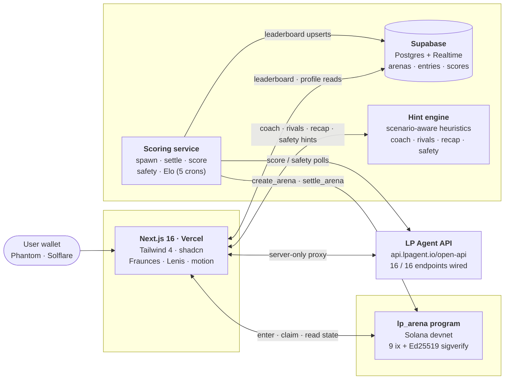

<div align="center">

# LP Arena

### LPing is a sport now.

Meteora LP performance, scored live by LP Agent, on a Solana prize-pot Anchor program.

**[lp-arena.vercel.app](https://lp-arena.vercel.app)** &nbsp;·&nbsp; **[60-second walkthrough →](https://youtu.be/lp-arena)**

<sub>_Live URL + video link land here on submission day. Devnet proofs and full source ship now._</sub>

</div>

---

## The problem, in one line

Meteora LPing is a high-skill activity with no high-skill venue. Yields are private, leaderboards don't exist, and bragging rights die in a Discord screenshot. **Trading has tournaments. LPing doesn't.**

## The insight

LP Agent already publishes the only piece of data that makes LPing rank-able: **SOL-denominated PnL** (`pnlNative`, `dprNative`, `revenue`). Once LPs can be scored on the same axis, you can run a tournament. Tournaments need an escrow that pays winners and refuses to pay anyone else. That's a **9-instruction Anchor program**. Plug LP Agent into the scoring oracle and the rest is product.

LP Arena is that product: bounded "seasons" on real Meteora pools, on-chain prize pot, scored live by LP Agent's Premium API.

---

## Architecture



<details>
<summary>ASCII fallback</summary>

```
┌─────────────────────────────┐      ┌─────────────────────────────┐
│  Next.js 16 (Vercel)        │◀────▶│  Supabase                   │
│  Tailwind 4 · shadcn        │      │  Postgres + Realtime        │
│  Fraunces · Lenis · motion  │      │  arenas · entries · scores  │
└────────────▲────────────────┘      └──────────────▲──────────────┘
             │                                      │
             │ enter / claim / read arena state     │ upserts from cron
             ▼                                      │
┌─────────────────────────────┐      ┌──────────────┴──────────────┐
│  Solana devnet              │◀─────│  Scoring service (VPS)      │
│  lp_arena program           │      │  spawn · settle · score     │
│  9 instructions + Ed25519   │      │  safety · Elo crons         │
└────────────▲────────────────┘      └──────────────▲──────────────┘
             │                                      │
             └──── settle_arena (Ed25519 signed) ───┘
                                                    │
                                                    ▼
                                      ┌─────────────────────────────┐
                                      │  LP Agent API (Premium)     │
                                      │  api.lpagent.io/open-api    │
                                      │  → 16 / 16 endpoints wired  │
                                      └─────────────────────────────┘
```

</details>

---

## LP Agent endpoint matrix

> **Live: 16 / 16.** Every read endpoint, every Zap (in + out) endpoint, every position-data endpoint, plus the wallet token-balance endpoint — each wired to a real product surface. No "called from code, never reaches a screen" cheating.

| # | Endpoint | Powers | Where to see it |
|---|---|---|---|
| 1 | `GET /pools/discover` | Home arena grid (top-8 by TVL, 60s ISR) | `/` |
| 2 | `GET /pools/{id}/info` | Token icons + organic-score safety badges in arena hero | `/arena/[pubkey]` |
| 3 | `GET /pools/{id}/onchain-stats` | "On-chain pulse" card (open positions, unique LPs, input value) | `/arena/[pubkey]` |
| 4 | `GET /pools/{id}/top-lpers` | `<LiveLeaderboard />` — top-10 LPs ranked by realized PnL with ROI / APR / win-rate | `/arena/[pubkey]` |
| 5 | `GET /lp-positions/overview` | Profile header KPIs (lifetime PnL, ROI, fees collected) | `/profile/[pubkey]` |
| 6 | `GET /lp-positions/opening` | `<TrophyCase />` — open positions on profile | `/profile/[pubkey]` |
| 7 | `GET /lp-positions/historical` | `<TrophyCase />` — closed-position history on profile | `/profile/[pubkey]` |
| 8 | `GET /lp-positions/revenue/{owner}` | `<EquityCurve />` — cumulative PnL over 30d | `/profile/[pubkey]` |
| 9 | `POST /pools/{id}/add-tx` | **Zap-In step 1** — generate add-liquidity tx after on-chain `enter_arena` | `/arena/[pubkey]/enter` |
| 10 | `POST /pools/landing-add-tx` | **Zap-In step 2** — submit signed tx via Jito for better landing | `/arena/[pubkey]/enter` |
| 11 | `POST /position/decrease-quotes` | Zap-Out quote preview before user confirms exit | `/arena/[pubkey]` (post-claim) |
| 12 | `POST /position/decrease-tx` | **Zap-Out step 1** — generate decrease tx | `/arena/[pubkey]` (post-claim) |
| 13 | `POST /position/landing-decrease-tx` | **Zap-Out step 2** — submit signed exit tx via Jito | `/arena/[pubkey]` (post-claim) |
| 14 | `GET /pools/{id}/positions` | "Tracked positions" + sample top owner stats on arena pulse card | `/arena/[pubkey]` |
| 15 | `GET /lp-positions/logs` | `<PositionLogsFeed />` — native on-chain action log on profile | `/profile/[pubkey]` |
| 16 | `GET /token/balance` | Pre-flight SOL balance shown in Entry Wizard step 2 (red if < entry fee) | `/arena/[pubkey]/enter` |

**Conventions.** All calls are server-only — the Premium key (`LPAGENT_API_KEY`) never reaches the browser. Read endpoints use Next.js ISR with `revalidate: 60` to cushion rate limits. Zap endpoints are proxied through internal `/api/zap/*` routes; the browser never talks to LP Agent directly. Every typed method is unit-tested with MSW fixtures; every page is end-to-end tested in Playwright across light and dark color schemes.

---

## Devnet proofs

| | |
|---|---|
| **Program** | [`Hrto23usPNyEYdmpVCVppM37M7vyBFd1sFhfRtTFGEc4`](https://explorer.solana.com/address/Hrto23usPNyEYdmpVCVppM37M7vyBFd1sFhfRtTFGEc4?cluster=devnet) |
| **Config PDA** | [`kKkk8vJXRuPRa88Q7LeKVQs4aWH6D326XidQg3D4Qtg`](https://explorer.solana.com/address/kKkk8vJXRuPRa88Q7LeKVQs4aWH6D326XidQg3D4Qtg?cluster=devnet) — 200 bps protocol fee, oracle `E38yZp8h…` |
| **Live judging arena** | [`CfUmX84hp7BkuwTVT5gK61kWfp9VCnoKih8m6buv2b9r`](https://explorer.solana.com/address/CfUmX84hp7BkuwTVT5gK61kWfp9VCnoKih8m6buv2b9r?cluster=devnet) — USD1·SOL, ends 2026-05-02, 0.025 SOL entry, 50/30/20 split |

**Three example transactions, one per critical instruction:**

| Instruction | Transaction |
|---|---|
| `create_arena` | [`5Ze7TKXb…6m16`](https://explorer.solana.com/tx/5Ze7TKXbVBUWcSboyi3E9cSRnkhaFxJsTatYoTUT5aHiMcLxqQdD3t8xketD8YLXNfVRvMGs8L8DMTnkyJwa6m16?cluster=devnet) — spawn cron auto-created arena #3 on USD1·SOL |
| `settle_arena` | [`22WHsn6z…p42Pz`](https://explorer.solana.com/tx/22WHsn6zPFUFm81SMN7AZjGK7Ea3LWWBiwN4wSVNT9EbHyPPswKGnE2VekNs7pqwJr6p6Lm3UeigHAKxPbFp42Pz?cluster=devnet) — `Ed25519Program::sigverify` + `lp_arena::settle_arena` in one transaction |
| `claim_payout` ×3 | top-3 claim txs visible in [arena `CpiLFf…`'s tx history](https://explorer.solana.com/address/CpiLFfpaeYQ9K6yLbepK2LT5s4TDcbGDLzjE6sw91Po1?cluster=devnet) — rank-1 / 2 / 3 received 0.049 / 0.0294 / 0.0196 SOL; rank-4 correctly rejected with `NotInPrizePositions` |

`scripts/full-flow.ts` reproduces the entire path end-to-end on devnet: create arena → 4 wallets enter → wait for `end_ts` → settle with locally-signed payload → top-3 claim → rank-4 rejected.

---

## Run locally

Requires Node 20+, pnpm 9+, and an LP Agent Premium API key.

```bash
git clone <repo> && cd lptrack
pnpm install
cp .env.example .env.local      # set LPAGENT_API_KEY (+ Supabase + Helius RPC)
pnpm --filter app dev           # http://localhost:3000
```

Tests:

```bash
pnpm --filter app test:unit     # Vitest + MSW (LP Agent client)
pnpm --filter app test          # Playwright (every page, light + dark)
```

---

## What's next

- **Mainnet.** Devnet is the proof; mainnet needs a real custody story for the admin key (multisig or remote signer) and at least one full settled-on-devnet season as evidence. Both arrive in the Frontier track build.
- **MCP bolt-on.** Six tools — `list_arenas`, `arena_detail`, `suggest_range`, `enter_arena`, `my_positions`, `exit_arena` — let Claude Desktop run the full flow without the web UI. Same Anchor program, same LP Agent calls.
- **Creator arenas.** Top-50 LPers (gated via `/pools/{id}/top-lpers`) can spin their own seasons. Wager UI on the arena detail page lets spectators take sides. Both already have program-side scaffolding in `place_wager` and the creator-bond branch of `create_arena`.

---

<div align="center">

Powered by **[LP Agent](https://lpagent.io)** · **[Meteora](https://meteora.ag)** · **[Solana](https://solana.com)**.

</div>
